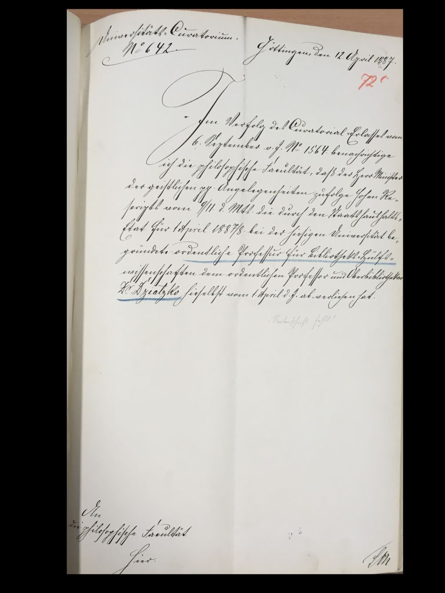
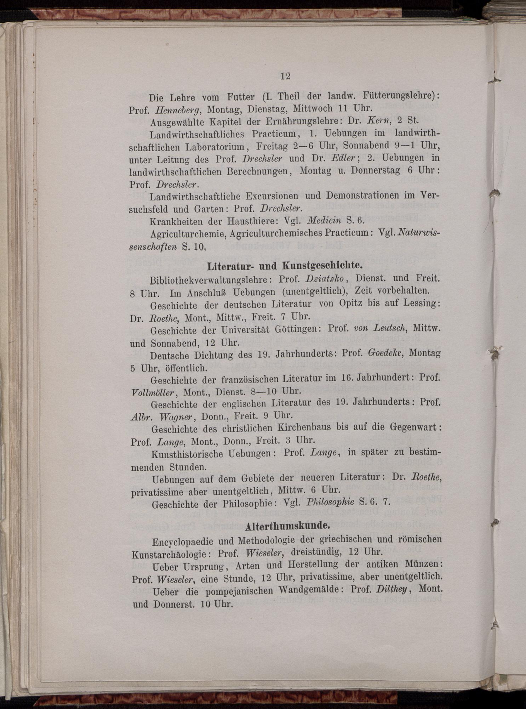
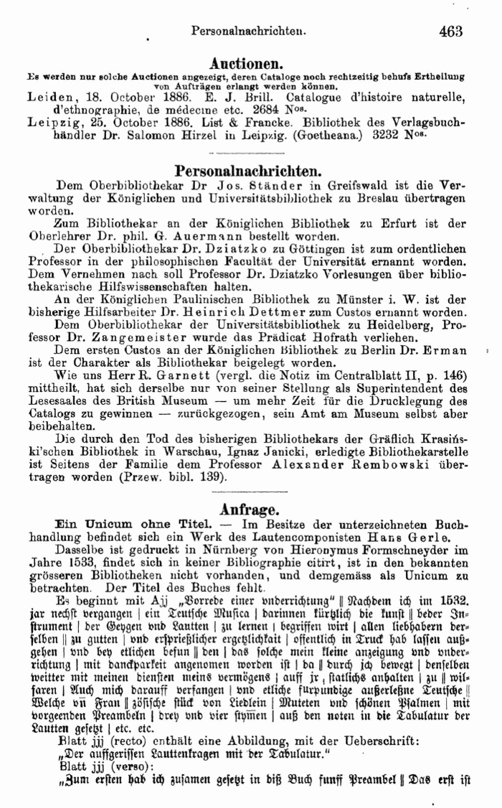

*Großer Dank gebührt Dr. Christian Fieseler von der SUB Göttingen und
Dr. Holger Berwinkel vom Universitätsarchiv in Göttingen für die
Aufarbeitung und Bereitstellung der historischen Informationen in diesem
Beitrag.*

> "Es ist mit erfreulich, Euer Hochwohlgeboren im Verfolg meines
> Erlasses vom 22. Juli d\[iesen\] J\[ahres\] \[...\] davon in Kenntniß
> zu setzen, daß Seine Majestät der Kaiser und König Allergnädigst
> geruht haben, Sie zum ordentlichen Professor in der philosophischen
> Fakultät der Universität Göttingen zu ernennen. Indem ich Ihnen die
> darüber ausgefertigte, unterm 15. August d. J. Allerhöchsten Orts
> vollzogene Bestallung beifolgend übersende, verleihe ich Ihnen in der
> genannten Fakultät das \[\...\] Ordinariat mit dem Bemerken, daß ich
> mir wegen Ertheilung eines Lehrauftrages die Verfügung einstweilen
> vorbehalte." \[Schreiben aus dem Ministerium der geistlichen,
> Unterrichts- und Medicinalangelegenheiten an Karl Dziatzko vom 26.
> August 1886. Aus Dziatzkos Personalakte (Kur. Nr. 5961 ), der zu der
> Zeit Oberbibliothekar in Göttingen war.\]

Die Entstehungsgeschichte des Instituts für Bibliotheks- und
Informationswissenschaft der Humboldt-Universität zu Berlin ist eng mit
der Universität Göttingen verbunden. Wie in der vorbildlichen
Ausarbeitung von Renate Rohde[^1]
bereits gezeigt, wurde 1886/1887 zunächst ein Lehrstuhl in Göttingen
eingerichtet. Zum Jubiläum des IBI sollen einige Aushebungen ergänzt
werden.

Erster Inhaber des Lehrstuhls war der derzeitige Oberbibliothekar
(Bibliotheksdirektor) Karl Dziatzko. Hätte Karl Dziatzko gedacht, dass
mehr als 125 Jahre später drei Generationen Göttinger
Bibliotheksdirektoren als Professoren gleichzeitig an einem Berliner
Institut aktiv sind? Er konnte ja nicht wissen, dass der Göttinger
Lehrstuhl 1921 nach Berlin verlagert werden sollte. Oder wusste er es
doch? Bemerkenswert ist, dass einige Traditionen schon damals angelegt
waren, wie in einem weiteren Schreiben vom 6. Oktober 1886 deutlich
wird:

> "Im Verfolg meines Erlasses vom 26. August d. J. \[...\] betreffend
> Ihre Ernennung zum ordentlichen Professor in der philosophischen
> Fakultät der dortigen Universität, ertheile ich Euer Hochwohlgeboren
> hiermit den Lehrauftrag, Vorlesungen und Übungen über
> Bibliotheks-Hülfswissenschaften zu halten, wobei ich indeß Ihrem
> Wunsche gemäß voraussetze, daß der Umfang Ihrer Lehrtätigkeit sich auf
> 3 bis 4 Stunden wöchentlich beschränken wird, indem, wie ich gerne
> anmerke, Ihre Hauptarbeit der Verwaltung der Universitäts-Bibliothek
> gewidmet sein muß."

Die drei heutigen Göttinger Professoren am IBI erleben in der Tat das
gleiche Schicksal einer Doppelrolle und eines eingeschränkten
Lehrumfangs, die Karl Dziatzko offensichtlich bereits 1886 formuliert
hat. Einige Dinge in Wissenschaft und Bibliothekswesen ändern sich
offenbar gar nicht. Aber wie hätte sich "elektronisches Publizieren"
oder "digitale Geisteswissenschaft" in Karl Dziatzkos Ohren angehört --
eingedenk des Umstandes, dass H.G. Wells zu dieser Zeit vielleicht
gerade einmal die ersten Ideen zur "Zeitmaschine" im Kopf spukten? Oder
gibt es eine geheime Verbindung zwischen Zukunftsvorhersagen und
Bibliothek? (Immerhin schrieb auch Ray Bradbury "Fahrenheit 451" im
Keller der Powell-Bibliothek der University of California, Los Angeles.)

Die Suche nach weiteren versteckten Anzeichen einer Verbindung von
Bibliothek zu Zukunftsvorhersagen bestätigt sich zunächst nicht. Der
ministerielle Erlass wurde nüchtern zum Beginn des Haushaltsjahres
1887/1888 umgesetzt. (Von einer weiteren Aufarbeitung des Datums "1.
April" soll an dieser Stelle abgesehen werden.)

> "Im Verfolg des Curatorial-Erlasses vom 6. September v\[origen\]
> J\[ahres\] No. 1564 benachrichtige ich die philosophische Fakultät,
> daß der Herr Minister der geistlichen pp. Angelegenheiten zufolge
> hohen Rescripts vom 9./11. d\[es\] M\[ona\]ts die durch den
> Staatshaushalts-Etat für 1. April 1887/8 bei der hiesigen Universität
> begründete ordentliche Professur für Bibliotheks-Hülfswissenschaften
> dem ordentlichen Professor und Oberbibliothekar Dr. Dziatzko hieselbst
> vom 1. April d\[es\] J\[ahres\] ab verliehen hat."
> \[Universitäts-Curatorium No. 642, Göttingen, den 12. April 1887\]

Auch die erste Lehrveranstaltung Karl Dziatzkos deutet nicht auf
wahrsagerische Verwicklungen. Im Vorlesungsverzeichnis der Universität
Göttingen heißt es unter Literatur- und Kunstgeschichte:

> "Bibliotheksverwaltungslehre: Dienst. und Freit. 8 Uhr, im Anschluss
> Übungen (unentgeltlich). Zeit vorbehalten."

Oder ist dies eine offenkundige Zurschaustellung des mitunter als
trocken empfundenen Bibliotheksrufs, die eigentlich eine versteckte
Kritik am Bibliothekswesen ist, die auch im Jahr 2018 noch gelten
sollte? Denn so ganz sicher und geheuer war die Causa Dziatzko der
Bibliothekswelt im Jahr zuvor offenbar nicht, wie man dem Zentralplatt
für das Bibliothekswesen vom November 1886 (Heft 11) in der Rubrik
Personalnachrichten (S. 463) entnehmen kann:

> "\... Dem Vernehmen nach soll Professor Dr. Dziatzko Vorlesungen über
> bibliothekarische Hilfswissenschaften halten."

Es lässt sich über die zeitbeugenden Eigenschaften der
bibliothekarischen Forschung zum Beispiel in Margrit Bornhöfts Arbeit
von 1999 "Bibliothekswissenschaft in Deutschland. Eine Bestandsaufnahme"
(Aachen: Verlag Mainz) mehr erfahren. Seien wir gespannt, ob wir bis zum
100. Jubiläum im Jahr 2028 weitere Erkenntnisse erfahren können.

[^1]: Renate Rohde. Zur Geschichte der bibliothekswissenschaftlichen Ausbildung in Berlin. <https://www.ibi.hu-berlin.de/de/institut/leitbild/gesch-ausbildung/gesch-ausbildung>

